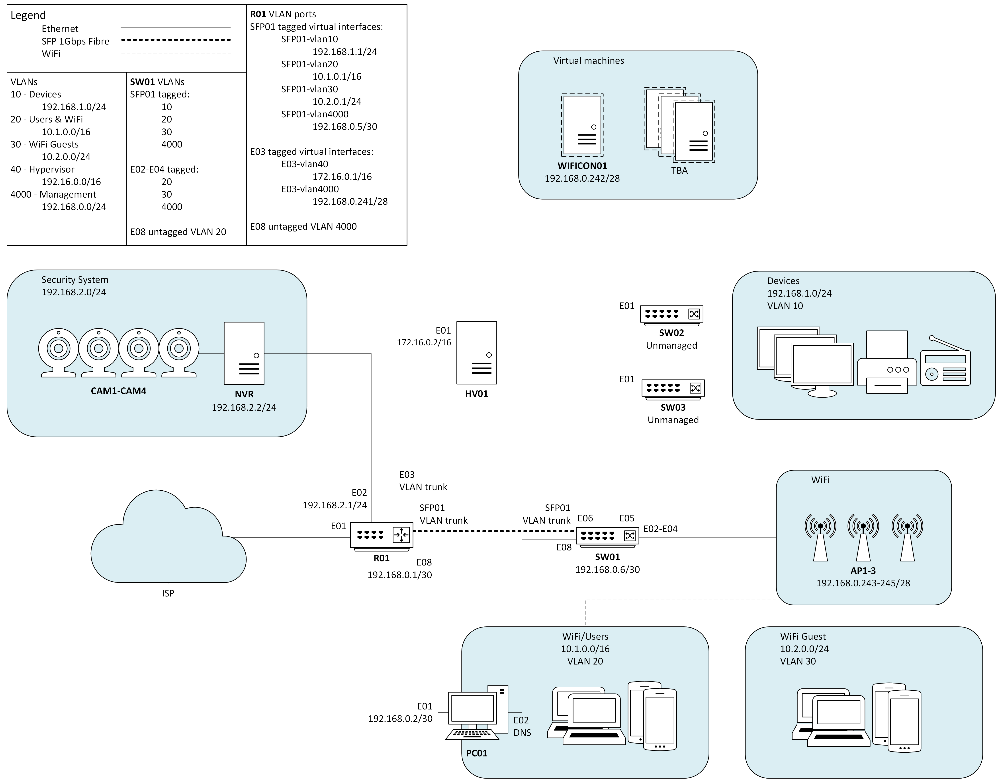

# WIP
This folder is a WIP of public documentation of my home network.

# Home Network
This folder contains documentation and config for my home network.

## Topology

### Networks & VLANS
- MGMT
    192.168.0.0/24 - For management of network devices Isolated from other networks.
    VLAN 4000
- Devices
    192.168.1.0/24 - For wired household devices such as printers, TVs, media devices, smarthome devices, IoT devices, etc.
    VLAN 10
- NVR
    192.168.2.0/24 - For the security camera system.
- Servers
    172.16.0.0/16 - For any VMs and services operating on the HV01 [hypervisor](../Hypervisor).
    VLAN 40
- WiFi & Users
    10.1.0.0/16 - For standard household WiFi and wired users.
    VLAN 20
- WiFiGuest
    10.2.0.0/24 - For guests. Isolated to prevent access to any other local networks.
    VLAN 30

## Devices
### R01
Mikrotik L009UiGS-RM
Hardware offloading disabled to allow practice implementation of OSPF routing.

#### R01 Interfaces
- E01		DHCP from ISP
- E02		192.168.2.1/24
- E03   virtual interfaces:
  - e03-vlan40
    192.168.3.1/24
    tagged VLAN 40
  - e03-vlan4000
    192.168.0.1/28
    tagged VLAN 4000
- E08 	192.168.0.9/28
- SFP01
  - sfp01-vlan10
    192.168.1.1/24
    tagged VLAN 10
  - sfp01-vlan20
    10.1.0.1/16
    tagged VLAN 20
  - sfp01-vlan30
    10.2.0.1/24
    tagged VLAN 30
  - sfp01-vlan4000
    192.168.129.1/25
    tagged VLAN 4000

### SW01
TP-Link TL-SG1210MPE
Managed switch handling VLANs via 802.11Q.

#### SW01 802.1Q VLAN Ports
- SFP01	- 10, 20, 30, 4000
- E02 - 20, 30, 4000
- E03 - 20, 30, 4000
- E04 - 20, 30, 4000
- E05 - 10 (untagged)
- E06 - 10 (untagged)
- E08 - 20 (untagged)

### SW02 & SW03
TBA
These will be small PoE powered, unmanaged switches to allow ethernet connectivity of multiple media devices in the home theatre and living room.

### AP01, AP02, & AP03
TP-Link EAP-615 wall-mounted PoE access points.
These are controlled by an Omada Software Controller hosted on HV01 in a Docker container.
Configured to serve several WiFi networks that all support fast roaming via 802.11k/v/r.
A primary WLAN supports the majority of users accross both 2.4GHz and 5GHz bands.
A secondary 2.4GHz WLAN supports household legacy devices that only support older 2.4GHz protocols.
A third guest WLAN is configured as a copy of the first with a different SSID, and isolated on a separate network.

### HV01
Mini PC hypervisor running Proxmox.
See [hypervisor docs](../Hypervisor) for details.

### NVR
Network Video Recorder, i.e., security camera system.

### PC01
Home desktop workstation.

## Routing
### OSPF
#### Networks
- 192.168.0.0/24
- 192.168.1.0/24
- 192.168.2.0/24
- 10.1.0.0/16
- 10.2.0.0/24
- 172.16.0.0/16
See also [address lists](./RouterConfig/Firewall/AddressLists).
#### Firewall/ACLs
Management network is isolated from all networks.
All inbound packets are denied, except for established and related packets.
This is to allow devices to connect to the internet for updates and recieve responses.

The WiFi guest network is isolated from all other networks.
Access from the guest network to any private IPs or the router IP is denied.
The router IP is included as it will have a public IP provided by the ISP on that interface which could be used to access the device.

The security camera network may be isolated to only the users network.
However, it is currently unknown whether removing internet access would disable functionality of the current software.
Moving to open source, self managed software is a consideration to facilitate this.
This is TBC

The devices netowrk should be restricted to accessing to/from the users network and internet only.
It is unlikely these devices will need to access any servers.
This is TBC.

The server network firewall rules are TBD.

See [firewall filters](./RouterConfig/Firewall/FirewallFilters).